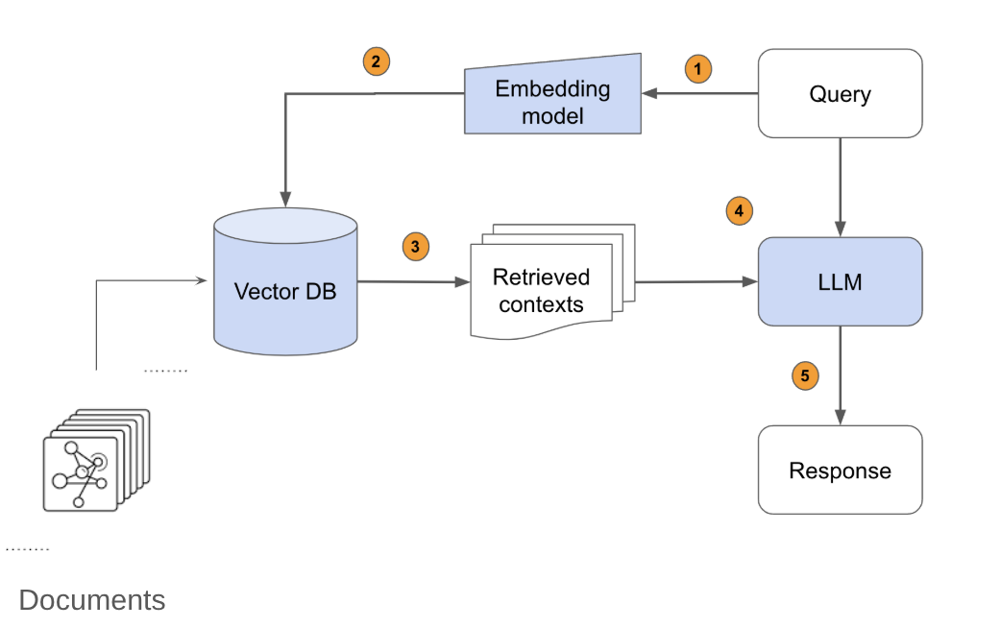

# AI-Tutor

## Prerequisites
- Python3
- Docling 
- chroma db


## How it works
* Given set of documents in diffrient format Converting them into md files using Docling.

* Build VectorDB given these set of formated documents using Chroma Db.
* Build Rag Application by utlizing LLM using langchain framework.
* Flask API has been used for integration with the frontend.
* **Overall architecture** 



## Overview of the code

* Folder AI-Tutor contains all the necessary files to run the RAG pipiline

* Folder AI-tutor-frontend conains the frontend to host the project


## Setup
- In order to install the dependancies run this commands


```
locate the Ai-Tutor
$ cd AI-Tutor

Create a virtual env and then run
$ pip install -r requirements.txt
```

## Runing RAG pipline 
```
python rag_single_query
```

## Runing the frontend 

* Install [Nodejs](https://nodejs.org/en/download) 
* Locate the frontend folder 
```
$ cd AI-tutor-frontend
$ cd new_ai_frontend/AI-tutor-frontend/client
```
* Run the following command
```
$
```


----
### In order to generate the Db Vector.
    * uncomment the DB section in docling_run.py file : this will create the DB vector alongside the converting format process


